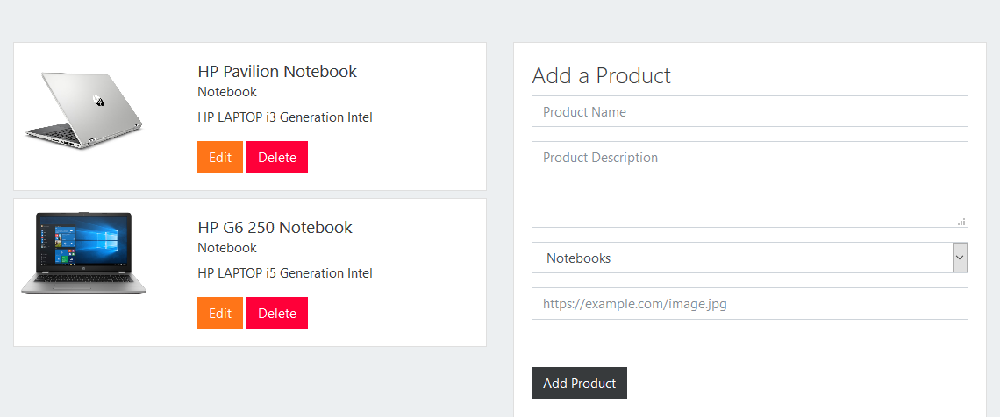

# Svelte app - CRUD Frontend Products🖇️

##### Author: Alan Gaia

This project it's a CRUD of Products E-Commerce Style

## How to Install
- You need to have installed Node.js

Then you can download the project and run:
-  npm install
-  npm run dev

Go to localhost:5000

